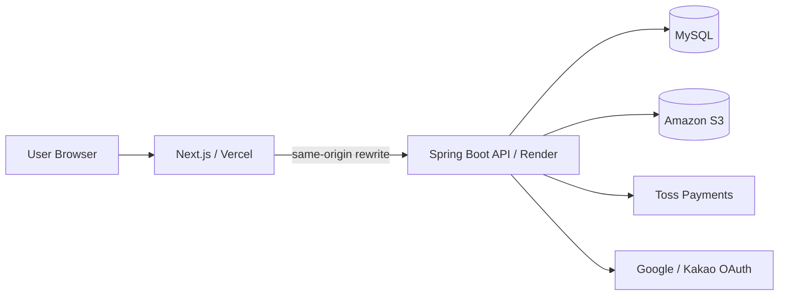

# Gift Market

> 선물 탐색부터 주문·결제·배송·클레임·판매자 정산까지 실제 커머스 흐름을 구현한 오픈마켓 서비스

Gift Market은 카카오톡 선물하기와 오픈마켓의 서비스 흐름을 참고해 개발한 개인 프로젝트입니다.  
단순 상품 CRUD를 넘어 **구매자·판매자·관리자 역할 분리, OAuth/JWT 인증, 상품/재고, 주문, Toss Payments 결제, 취소·반품·교환, 알림, 판매자 정산**까지 하나의 거래 흐름으로 연결하는 것을 목표로 구현했습니다.

기능 수를 늘리는 것보다 **결제 중복 처리, 재고 정합성, 부분 환불, Refresh Token 동시성, 정산 원장, 장애 복구처럼 실제 운영에서 문제가 될 수 있는 지점**을 설계하고 해결하는 데 중점을 두었습니다.

## 링크

- **Service:** https://gift-market-test.vercel.app
- **Backend API:** https://gift-market-api.onrender.com
- **Repository:** https://github.com/bys96/gift-market

> 현재 배포 환경은 포트폴리오/테스트 환경입니다.

## 프로젝트 개요

### 개발 목적

쇼핑몰 프로젝트는 상품 CRUD와 장바구니만으로도 화면상 완성할 수 있지만, 실제 서비스에서는 결제 이후부터 훨씬 많은 상태와 예외 상황이 발생합니다.

Gift Market은 이러한 문제를 직접 다루기 위해 시작했습니다.

- 구매자·판매자·관리자가 서로 다른 권한과 업무를 갖는 구조
- 결제와 주문 상태의 정합성
- 옵션 단위 재고 예약 및 복원
- 부분 취소와 환불
- 반품·교환과 추가 배송
- 브라우저/네트워크 장애 상황의 결제 복구
- 판매자별 주문 분리
- 거래 이후 판매자 정산

특히 기능을 각각 독립적으로 만드는 대신 **주문 → 결제 → 배송 → 클레임 → 정산**이 하나의 일관된 도메인 흐름으로 동작하도록 설계했습니다.

### 개발 형태

- 개인 프로젝트
- Frontend / Backend / Database / 배포 전체 구현
- 개발 기간: 2026-07-20 ~

## 주요 기능

### 인증 / 회원

- Google / Kakao OAuth2 로그인
- JWT Access Token / Refresh Token 인증 및 Rotation
- Refresh Token 동시 갱신 제어 및 grace 처리
- 회원 프로필 / 배송지 관리
- 회원 탈퇴 Soft Delete 및 개인정보 익명화
- 탈퇴 후 동일 OAuth 계정 신규 가입
- USER / SELLER / ADMIN 역할 관리

### 판매자 / 상품

- 판매자 신청 / 관리자 승인·거절
- Seller Store 및 고객센터 정보 관리
- 상품 / 옵션 / 옵션별 재고 관리
- 이미지 및 MP4 상세 미디어
- S3 Presigned URL 기반 파일 처리
- 검색 / 필터 / 페이지네이션
- 찜 / 상품문의 / 리뷰
- 판매자 주문 / 배송 / 문의 답변
- 판매자 직접 주문 취소 및 부분 환불

### 주문 / 결제

- 장바구니 주문 / 바로 구매
- 주문 시점 상품 정보 Snapshot
- 판매자별 SellerOrder 분리
- 주문 시 재고 예약
- Toss Payments 결제 승인 및 부분 취소
- 결제 금액 서버 검증 및 멱등성 처리
- 결제 승인 결과 유실 / sessionStorage 유실 복구
- 결제 상태 reconciliation
- 결제 재시도 시 오래된 주문 Snapshot 검증

### 취소 / 반품 / 교환

- 구매자 전체·부분 취소
- 판매자 직접 취소
- Toss 부분 환불
- 취소·반품 수량 기반 재고 복원
- BUYER / SELLER 취소 요청 주체 구분
- 반품 / 교환 상태 관리
- 교환 배송 및 추가 배송비 결제 구조
- 진행 중 Claim 간 충돌 방지

### 알림

- BUYER / SELLER / ADMIN Context 분리
- 읽음 / 전체 읽음 / 미확인 수
- 주문·배송·클레임·문의 이벤트 연동
- Transaction AFTER_COMMIT 이후 알림 생성
- Reference 기반 관련 화면 이동

### 정산

- 판매자별 SettlementLedgerEntry
- 상품 매출 / 배송비 / 수수료 / 환불 / 수수료 환입 기록
- 배송 완료 후 정산 가능일 계산
- 진행 중 Claim 정산 제외
- READY / ON_HOLD / CONFIRMED
- 관리자 정산 생성 / 보류 / 해제 / 확정
- 판매자 정산 조회
- 확정된 과거 정산 불변성 유지
- 이후 환불은 다음 정산에 음수 원장으로 반영

> 실제 판매자 계좌 지급(Payout)은 Settlement와 분리하여 향후 구현 예정입니다.

## 주요 화면

> 실제 스크린샷/GIF 추가 필요

추천 화면:

- 메인 화면
- 상품 상세
- Toss Payments 결제
- 구매자 주문 상세
- Seller Center
- 판매자 정산
- Admin
- 모바일 화면

## 기술 스택

### 프론트엔드

- Next.js / React / TypeScript
- App Router
- CSS
- Vercel

### 백엔드

- Java 21
- Spring Boot
- Spring Security
- Spring Data JPA
- Bean Validation
- OAuth2 / JWT

### 데이터베이스 / 스토리지

- MySQL
- Amazon S3
- MinIO (Local)

### 결제 / 인프라

- Toss Payments
- Docker
- Render
- Java AppCDS

## 시스템 구조



운영 환경에서는 Vercel rewrite를 이용해 `/api`, `/oauth2`, `/login/oauth2` 요청을 Backend로 전달합니다.

### 주요 거래 흐름

```text
상품 선택
  ↓
주문 생성 / 재고 예약
  ↓
Payment READY
  ↓
Toss Payments
  ↓
결제 승인
  ↓
Order / SellerOrder 상태 변경
  ↓
Settlement 초기 원장
  ↓
배송 / 배송 완료
  ↓
정산 가능일 도달
  ↓
Settlement 생성 / 검증 / 확정
```

## 핵심 구현

### 1. 판매자 단위 주문 분리

하나의 주문에 여러 판매자의 상품이 포함될 수 있어 `Order`와 `SellerOrder`를 분리했습니다.

```text
Order
 ├─ SellerOrder A
 │   ├─ OrderItem
 │   └─ Shipment
 └─ SellerOrder B
     ├─ OrderItem
     └─ Shipment
```

`Order`는 구매자의 전체 주문, `SellerOrder`는 판매자별 실제 이행 단위입니다. 특정 판매자의 배송·취소가 다른 판매자의 거래에 영향을 주지 않도록 구성했으며, 모든 SellerOrder가 취소되었을 때 부모 Order 상태를 동기화합니다.

### 2. 결제 응답 유실을 고려한 복구

브라우저의 `sessionStorage`가 유실되거나 Toss 승인 직후 네트워크 문제가 발생해도 Frontend 상태를 결제의 최종 기준으로 사용하지 않습니다.

```text
Toss Callback
   ↓
merchantPaymentId + 로그인 사용자
   ↓
Server Payment 조회
   ↓
READY       → 검증 후 confirm
CONFIRMING  → 결과 재조회
PAID        → 성공 복구
FAILED 등   → 실패 처리
```

서버 Payment를 Source of Truth로 사용하고, confirm 예외 역시 즉시 실패로 단정하지 않고 상태 재조회와 reconciliation을 수행합니다.

### 3. Refresh Token Rotation 동시성 제어

동시에 발생한 Refresh 요청이 서로의 Token을 무효화하지 않도록 Refresh Token Row에 `PESSIMISTIC_WRITE` Lock을 적용했습니다.

직전 Token Hash를 짧은 grace 기간 동안 유지하고 현재 Refresh Token은 AES-GCM으로 암호화해 저장합니다. Frontend 인증 초기화도 공유 Promise로 통합해 불필요한 동시 Refresh를 줄였습니다.

### 4. Ledger 기반 판매자 정산

현재 주문 상태를 다시 계산해 과거 정산을 변경하는 대신 거래 이벤트를 Ledger로 기록합니다.

```text
결제 성공
 ├─ SALE_PRODUCT +
 ├─ SALE_SHIPPING +
 └─ COMMISSION -

취소 / 반품
 ├─ REFUND -
 └─ COMMISSION_REVERSAL +
```

배송 완료 후 Hold 기간을 거쳐 정산 가능 상태가 되며, 진행 중 Claim은 Settlement 생성에서 제외합니다. 이미 확정된 Settlement는 수정하지 않고 이후 환불은 다음 정산에 음수 원장으로 반영합니다.

### 5. AFTER_COMMIT 기반 알림

핵심 거래가 알림 저장 실패 때문에 롤백되지 않도록 비즈니스 Transaction에서는 이벤트를 발행하고, 커밋 이후 Notification을 별도 Transaction으로 생성합니다.

```text
Business Transaction
   ↓
Domain Event
   ↓
COMMIT
   ↓
AFTER_COMMIT
   ↓
NotificationService (REQUIRES_NEW)
```

## 트러블슈팅

### Refresh Token 동시 갱신

**문제**  
여러 Refresh 요청이 동시에 실행되면서 정상 로그인 세션이 불안정해질 수 있었습니다.

**원인**  
Rotation 과정에서 동일 Token을 여러 요청이 동시에 읽고 갱신할 수 있었습니다.

**해결**

- PESSIMISTIC_WRITE Lock
- 이전 Token Hash grace 처리
- 현재 Token 암호화 저장
- Frontend 인증 초기화 공유 Promise

**결과**  
동시 갱신 상황에서도 일관된 Refresh Token 상태를 유지하도록 개선했습니다.

### Toss 결제 결과 유실

**문제**  
결제 승인 직후 네트워크 오류나 sessionStorage 유실 시 실제 결제 여부와 화면 상태가 달라질 수 있었습니다.

**해결**

- merchantPaymentId + 로그인 사용자로 서버 Payment 재조회
- 서버 Payment를 Source of Truth로 사용
- READY만 confirm
- CONFIRMING은 재승인하지 않고 reconciliation
- PAID는 성공 상태로 복구

**결과**  
브라우저 상태가 유실되어도 서버의 실제 결제 상태를 기준으로 복구할 수 있게 됐습니다.

### 결제 재시도 시 오래된 주문 Snapshot

**문제**  
결제창을 닫은 뒤 배송지 등을 변경해도 기존 준비 주문이 재사용될 수 있었습니다.

**해결**

- 재시도 전 Payment / Order 재검증
- 배송 정보만 변경된 경우 READY Order Snapshot 갱신
- 상품 조건이 달라진 경우 기존 준비 주문 취소 및 예약 재고 복원
- PAID / CONFIRMING 상태별 별도 처리

**결과**  
멱등성을 유지하면서 오래된 주문 정보로 결제되는 문제를 방지했습니다.

### 부분 환불과 정산 수수료 정합성

**문제**  
여러 번의 부분 취소·반품에서 독립적으로 수수료를 계산하면 원 단위 절삭 오차가 누적될 수 있었습니다.

**해결**

- 최초 수수료율 Snapshot 유지
- 누적 환불 기준 수수료 환입
- 최초 수수료를 초과하지 않도록 상한 적용
- 기존 Ledger 수정 대신 새로운 Entry 생성

**결과**  
여러 부분 환불에서도 최초 수수료와 최종 환입 금액의 정합성을 유지했습니다.

### Render Spring Boot Startup 최적화

**문제**  
제한된 Render CPU 환경에서 Spring Boot 시작 시간이 길었습니다.

**해결**  
Java 21 Dynamic AppCDS를 Docker Image Build 과정에 적용하고 실제 환경에서 A/B 검증했습니다.

**결과**  
측정 기준 약 **258초 → 164초** 수준으로 시작 시간이 감소했습니다.

### 운영 DB 시간 9시간 차이

**문제**  
운영 DB의 결제·정산 시간이 실제 KST와 9시간 차이 났습니다.

**원인**  
JVM, JDBC, MySQL Session의 Timezone 기준이 일치하지 않았습니다.

**해결**  
`LocalDateTime + DATETIME(6)` 정책에 맞춰 JVM과 JDBC Connection Timezone을 KST 기준으로 통일했습니다.

**결과**  
결제·배송·정산 시간이 동일한 KST Wall-clock 기준으로 저장되고 계산됩니다.

## 프로젝트 구조

```text
gift-market
├── giftmarket-api
│   └── src/main/java/com/giftmarket
│       ├── admin
│       ├── auth
│       ├── cart
│       ├── inquiry
│       ├── notification
│       ├── order
│       ├── payment
│       ├── product
│       ├── review
│       ├── seller
│       ├── settlement
│       ├── shipment
│       ├── storage
│       ├── user
│       ├── wishlist
│       └── global
├── giftmarket-web
│   ├── app
│   ├── components
│   ├── lib
│   ├── stores
│   ├── styles
│   └── types
└── docs
    ├── DEVELOPMENT_STATUS.md
    ├── ROADMAP.md
    ├── SETTLEMENT_V1.md
    ├── PAYMENT_ARCHITECTURE_DESIGN.md
    ├── ORDER_CANCELLATION_REFUND_DESIGN.md
    ├── ORDER_RETURN_EXCHANGE_DESIGN.md
    ├── NOTIFICATION_DESIGN.md
    ├── TROUBLESHOOTING.md
    └── sql
```

## 로컬 실행 방법

### 프로젝트 내려받기

```bash
git clone https://github.com/bys96/gift-market
cd gift-market
```

### 백엔드

Java 21이 필요합니다.

```bash
cd giftmarket-api
./gradlew bootRun
```

Windows:

```bash
gradlew.bat bootRun
```

### 프론트엔드

```bash
cd giftmarket-web
npm install
npm run dev
```

기본 개발 서버: `http://localhost:3000`

### 환경 설정

실제 Secret 및 Credential은 Repository에 포함하지 않습니다.

로컬 실행에 필요한 환경 설정은 다음 예제 파일을 기준으로 구성합니다.

- Backend: `application-example.yaml`
- Frontend: `.env.sample`

주요 설정 항목은 다음과 같습니다.

- MySQL Database
- Google / Kakao OAuth2
- JWT / Refresh Token
- MinIO / Amazon S3
- Toss Payments
- Frontend / Backend Origin
- Settlement 정책

로컬 환경에서는 MinIO를 사용하고 운영 환경에서는 Amazon S3를 사용합니다.

운영 환경의 Frontend는 Vercel Rewrite를 통해 Backend API로 요청을 전달하며, 운영 Database는 Hibernate `ddl-auto=validate`를 사용합니다. Schema 변경은 현재 배포 전 DDL을 수동 적용합니다.

> OAuth Secret, JWT Secret, AWS Credential, Toss Payments Key 등의 실제 값은 Repository에 포함하지 않습니다.

## 담당 범위

개인 프로젝트로 요구사항과 도메인 설계부터 Frontend, Backend, Database, 외부 API 연동, 배포까지 전체 개발을 담당했습니다.

주요 구현 범위:

- 도메인 / DB / REST API 설계
- OAuth2 / JWT 인증
- 상품 / 옵션 / 재고
- 주문 / 결제
- 취소 / 부분 환불
- 반품 / 교환
- Seller Center / Admin
- Notification / Settlement
- S3 Storage
- Next.js 구매자·판매자·관리자 UI
- Render / Vercel 배포
- 거래 정합성 및 운영 장애 분석·개선

## 개발을 통해 배운 점

### 거래 기능에서는 성공 흐름보다 실패 경로가 중요하다

결제 승인 후 응답 유실, 중복 요청, 브라우저 종료, 네트워크 오류까지 고려하면서 Client 상태보다 서버의 영속 상태를 Source of Truth로 두고 멱등성과 reconciliation을 설계하는 경험을 했습니다.

### 외부 API와 DB는 하나의 Transaction이 아니다

Toss와 DB를 하나의 ACID Transaction으로 묶을 수 없기 때문에 외부 결제 성공과 내부 처리 실패가 서로 다른 시점에 발생할 수 있음을 고려해 상태 전이와 재처리 구조를 설계했습니다.

### 거래 이력은 현재 상태만큼 중요하다

정산을 구현하며 현재 주문 금액을 재계산하는 대신 매출·수수료·환불을 Ledger로 기록해 과거 정산을 보존하고 이후 변경을 추적하도록 구성했습니다.

### 동시성은 DB 레벨에서도 다뤄야 한다

Refresh Token, 결제, 정산 처리에서 DB Lock, Unique Constraint, Idempotency Key를 각각의 역할에 맞게 사용했습니다.

### 운영 환경은 로컬과 다르다

Render Startup 성능, JVM/JDBC/MySQL Timezone, 브라우저 인증 흐름 등을 실제 배포 환경에서 확인하면서 관측과 재현을 기반으로 문제를 좁히는 경험을 했습니다.

## 향후 계획

- Gift Occasion — 생일, 감사, 집들이 등 선물 상황 기반 탐색
- 메인 페이지 고도화
- 최근 순판매량 기반 상품 랭킹
- 상품 추천
- 쿠폰 / 포인트
- Settlement 자동 생성 Scheduler
- 실제 판매자 지급 Payout
- 판매자 계좌 / 지급 검증
- Seller 리뷰 답글
- Admin 클레임 중재
- S3 Orphan Object 정리
- Versioned DB Migration
- Monitoring / Metrics / Alert
- Backup / Recovery
- Terms / Privacy / Support 정비
