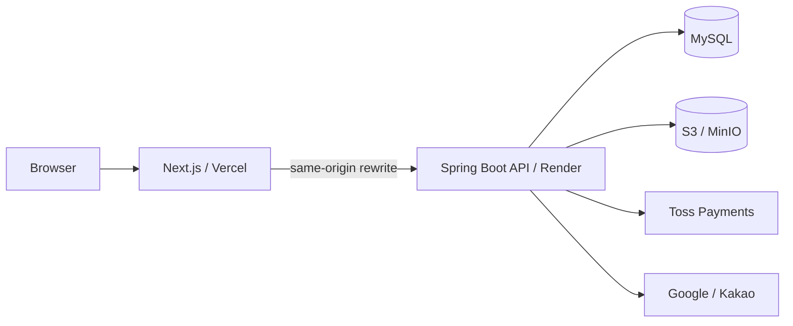

# Gift Market

> 주문·결제·배송·클레임·판매자 정산까지 거래의 전체 생명주기를 연결한 멀티셀러 커머스 서비스

Gift Market은 카카오톡 선물하기와 오픈마켓의 서비스 흐름을 참고해 개발한 개인 프로젝트입니다.
단순한 쇼핑몰 CRUD보다 **결제 결과 유실, 멀티셀러 주문, 재고·환불 정합성, Refresh Token 동시성, 반품·교환, Ledger 기반 정산**처럼 실제 거래 시스템에서 발생하는 문제를 직접 설계하고 해결하는 데 초점을 맞췄습니다.

## Links

- **Service**: https://gift-market-test.vercel.app
- **Backend API**: https://gift-market-api.onrender.com
- **Repository**: https://github.com/bys96/gift-market

> 현재 배포 환경은 포트폴리오 및 기능 검증을 위한 테스트 환경입니다.

---

## Project Overview

- **개발 형태**: 개인 프로젝트
- **개발 기간**: 2026-07-20 ~ 진행 중
- **담당 범위**: 요구사항 정의, 도메인/DB/API 설계, Frontend, Backend, 외부 API 연동, 배포

### 핵심 기술 과제

| 영역          | 문제                                 | 적용 방식                                                 |
| ------------- | ------------------------------------ | --------------------------------------------------------- |
| 멀티셀러 주문 | 판매자별 배송·취소·정산 독립 처리    | `Order → SellerOrder → OrderItem`, `Shipment 1:N`         |
| 결제          | PG와 내부 DB 상태 불일치             | 멱등성 Key, `CONFIRMING`, Provider 재조회, reconciliation |
| 인증          | 동시 Refresh 요청 충돌               | DB 비관적 잠금, previous token grace                      |
| 클레임        | 부분 취소·반품·교환의 수량·환불 충돌 | DB Lock, Snapshot, 환불 예약액 검증                       |
| 정산          | 과거 확정 정산 훼손 방지             | `SettlementLedgerEntry` 기반 증분 원장                    |

---

## Screenshots

<!--
촬영 순서 / 파일명
1. 01-home.png                메인 Hero + 상품 목록
2. 02-product-detail.png      상품 이미지 + 옵션 + 가격 + 구매 영역
3. 03-checkout-payment.png    배송지 + Toss Payments 결제 UI
4. 04-buyer-order-detail.png  주문/배송/취소·반품·교환 상태
5. 05-seller-dashboard.png    Seller Center 주문 관리
6. 06-seller-settlement.png   판매자 정산 요약 + 목록
7. 07-admin-dashboard.png     Admin Dashboard / Action Center
8. 08-admin-settlement.png    관리자 정산 관리

같은 상품/주문을 사용해 구매자 → 판매자 → 관리자 흐름이 이어져 보이게 촬영합니다.
개인정보, 주소, 결제키 등 식별정보는 노출하지 않습니다.
이미지는 docs/images/readme/ 에 저장합니다.
-->

### Buyer Flow

| 메인                                                       | 상품 상세                                                                 |
| ---------------------------------------------------------- | ------------------------------------------------------------------------- |
|  |  |
| 상품 탐색                                                  | 옵션·재고·배송 정보 기반 구매                                             |

| 주문·결제                                                                 | 주문 상세                                                                       |
| ------------------------------------------------------------------------- | ------------------------------------------------------------------------------- |
|  |  |
| Toss Payments 결제                                                        | 배송·취소·반품·교환 상태 확인                                                   |

### Seller / Admin

| Seller Center                                                              | 판매자 정산                                                               |
| -------------------------------------------------------------------------- | ------------------------------------------------------------------------- |
|  |  |
| 주문·상품·클레임 운영                                                      | Ledger 기반 정산 조회                                                     |

| Admin Center                                                             | 관리자 정산                                                              |
| ------------------------------------------------------------------------ | ------------------------------------------------------------------------ |
|  |  |
| 플랫폼 운영 현황                                                         | 정산 생성·보류·확정 관리                                                 |

---

## Main Features

### 인증 / 사용자

- Google OIDC / Kakao OAuth2 로그인
- JWT Access Token + HttpOnly Refresh Token
- Refresh Token Rotation 및 동시 갱신 제어
- 프로필 / 배송지 / 회원 탈퇴·익명화
- `USER / SELLER / ADMIN` 역할 분리

### 상품 / 판매자

- 판매자 신청 및 관리자 승인·거절
- 상품 / 옵션 그룹 / Variant / 옵션별 재고 관리
- S3 Presigned URL 기반 이미지·동영상 업로드
- Tiptap 기반 상품 상세 편집
- 검색 / 카테고리 / 필터 / 찜 / 문의 / 리뷰

### 주문 / 결제 / 클레임

- 장바구니·바로구매 및 판매자별 `SellerOrder` 분리
- 주문 시점 상품·옵션·가격·배송비 Snapshot
- 옵션 재고 예약·차감·복원
- Toss Payments 승인 / 조회 / 전체·부분 취소
- 주문 준비 및 PG 요청 멱등성
- 결제 결과 유실 시 Provider 재조회 및 reconciliation
- 전체·부분 취소 / 반품 / 교환 / 교환배송비 결제
- 최초배송·반품회수·교환회수·교환재배송 이력 분리

### 알림 / 정산

- `BUYER / SELLER / ADMIN` Context별 알림
- Transaction commit 이후 알림 저장
- 판매자별 `SettlementLedgerEntry`
- 매출 / 배송비 / 수수료 / 취소 / 반품 / 수수료 환입 기록
- `READY / ON_HOLD / CONFIRMED` 정산 상태 관리
- 확정 정산 불변성 및 이후 환불의 다음 회차 반영

> 현재 Settlement는 **정산 금액 확정**까지 담당하며 실제 판매자 계좌 지급(Payout)은 후속 도메인으로 계획하고 있습니다.

---

## Tech Stack

| 영역               | 기술                                                                          |
| ------------------ | ----------------------------------------------------------------------------- |
| Frontend           | Next.js 16, React 19, TypeScript, Zustand, Tailwind CSS 4, Tiptap 3           |
| Backend            | Java 21, Spring Boot 4, Spring Security, OAuth2 Client, Spring Data JPA, JJWT |
| Database / Storage | MySQL, H2(Test), Amazon S3, MinIO                                             |
| External           | Toss Payments, Google OAuth, Kakao OAuth                                      |
| Infra              | Vercel, Render, Docker                                                        |

---

## Architecture



### 거래 구조

```text
Order
├─ SellerOrder N
│  ├─ OrderItem N
│  ├─ Shipment N
│  ├─ OrderCancellation N
│  ├─ ReturnRequest N
│  └─ ExchangeRequest N
└─ Payment N
   └─ PaymentCancellation N

Seller
├─ SellerStore
├─ Settlement N
└─ SettlementLedgerEntry N
```

---

## Key Implementation

### 1. 멀티셀러 주문을 `Order → SellerOrder → OrderItem`으로 분리

구매자의 전체 주문과 판매자별 실제 이행 단위를 분리했습니다.

- `Order`: 구매자 관점의 전체 주문·결제
- `SellerOrder`: 판매자별 배송·취소·클레임·정산 단위
- `OrderItem`: 주문 시점 상품·옵션·가격 Snapshot
- `Shipment 1:N`: 최초배송 / 반품회수 / 교환회수 / 교환재배송 이력

한 판매자의 배송이나 클레임이 다른 판매자의 거래를 불필요하게 변경하지 않도록 구성했습니다.

### 2. 결제 결과 유실을 전제로 멱등성과 복구 흐름 설계

Toss Payments와 내부 DB는 하나의 ACID Transaction으로 묶을 수 없기 때문에 HTTP 오류를 곧바로 결제 실패로 확정하지 않았습니다.

```text
READY → CONFIRMING → PAID
          ↓
   Provider 재조회
          ↓
    reconciliation
```

- 외부 PG 호출을 DB Transaction 밖에서 수행
- 주문 준비 / PG 요청에 idempotency key 사용
- timeout·5xx·응답 유실은 `CONFIRMING` 상태에서 재조회
- callback의 브라우저 상태가 유실돼도 `merchantPaymentId`로 서버 Payment 복구
- 서버의 영속 Payment 상태를 Source of Truth로 사용

### 3. 부분 취소·반품·교환의 수량·재고·환불 정합성 보장

부분 Claim에서는 주문 수량뿐 아니라 이미 처리된 수량과 진행 중 요청이 점유한 수량을 함께 계산합니다.

```text
반품 가능 수량
= 주문 수량 - 취소 수량 - 완료 반품 수량 - 진행 중 반품 수량

환불 가능 금액
= 결제 금액 - 완료 환불액 - 처리 중 환불 예약액
```

관련 주문 데이터를 Lock한 뒤 DB 값을 다시 검증하고, 재고 reservation / release / restore를 Claim 상태 전이에 맞춰 처리했습니다.

### 4. Refresh Token Rotation 동시성 제어

동시에 여러 API가 401을 반환해 Refresh 요청이 겹치는 상황을 고려했습니다.

- Refresh Token Row 조회 시 `PESSIMISTIC_WRITE` Lock
- Current Token은 Rotation, Previous Token은 짧은 grace 경로로 처리
- Raw Token은 SHA-256 Hash로 비교
- Frontend 인증 초기화는 공유 Promise로 중복 Refresh 감소

### 5. 현재 주문 상태가 아닌 Ledger를 기준으로 정산

확정된 과거 정산이 이후 취소·반품 때문에 변경되지 않도록 거래 이벤트별 정산 원장을 남깁니다.

```text
결제 성공  → SALE_PRODUCT + / SALE_SHIPPING + / COMMISSION -
취소·반품 → REFUND - / COMMISSION_REVERSAL +
```

`CONFIRMED` Settlement는 수정하지 않고, 이후 환불은 다음 정산 회차에 음수 Ledger로 반영합니다.

> 상세 설계는 [`PAYMENT_ARCHITECTURE_DESIGN.md`](./docs/PAYMENT_ARCHITECTURE_DESIGN.md), [`SETTLEMENT_V1.md`](./docs/SETTLEMENT_V1.md)에서 확인할 수 있습니다.

---

## Troubleshooting

### 1. Toss 부분취소 결과가 불명확한 문제

- **문제**: timeout·5xx·응답 유실 시 실제 PG 취소 성공 여부를 알 수 없음
- **해결**: 불명확한 요청은 `PaymentCancellation REQUESTED`로 유지하고 Provider 거래를 재조회
- **결과**: 네트워크 오류를 실제 실패와 분리해 중복 환불 위험 감소

### 2. 결제 재시도 시 오래된 주문 Snapshot 재사용

- **문제**: 결제창 종료 후 배송지·상품 조건이 변경돼도 기존 READY 주문이 재사용될 수 있음
- **해결**: 재결제 전 Snapshot 재검증, 조건 변경 시 기존 주문 취소 및 예약 재고 복원 후 재생성
- **결과**: 멱등성을 유지하면서 오래된 주문 정보로 결제되는 문제 방지

### 3. 운영 DB Timestamp가 KST보다 9시간 뒤로 저장

- **원인**: JVM / JDBC / MySQL Session timezone 불일치
- **해결**: JVM `Asia/Seoul`, JDBC `connectionTimeZone=+09:00`, Session timezone 강제 적용
- **결과**: PG timestamp와 애플리케이션 생성 시각을 동일한 KST 기준으로 통일

> 수수료 절삭 오차, Render Startup 개선 등 추가 사례는 [`docs/TROUBLESHOOTING.md`](./docs/TROUBLESHOOTING.md)에 정리했습니다.

---

## Testing

상태 전이와 동시성 문제가 많은 거래 도메인을 중심으로 테스트했습니다.

- 주문 생성 / Snapshot / 재고 예약
- 결제 승인·만료·reconciliation
- 전체·부분 취소 / 반품 / 교환
- Refresh Token Rotation
- Settlement Ledger 생성·집계·상태 변경
- Admin / Seller 권한 및 운영 기능

```bash
# Backend
cd giftmarket-api
./gradlew test

# Frontend
cd ../giftmarket-web
npm run lint
node --test tests/*.test.mjs
```

---

## Project Structure

```text
gift-market
├── giftmarket-api
│   └── src/main/java/com/giftmarket
│       ├── auth
│       ├── order           # Order / SellerOrder / Shipment / Claim
│       ├── payment         # Payment / Cancellation / Reconciliation
│       ├── product
│       ├── seller
│       ├── settlement      # Settlement / Ledger
│       ├── notification
│       ├── admin
│       └── global
│           └── storage     # S3 / MinIO abstraction
│
├── giftmarket-web
│   ├── app                 # buyer / seller / admin routes
│   ├── components
│   ├── lib
│   ├── stores
│   ├── tests
│   └── types
│
└── docs                    # 상세 설계 / 트러블슈팅 / 로드맵
```

---

## Documentation

| 문서                                                                        | 내용                            |
| --------------------------------------------------------------------------- | ------------------------------- |
| [`DEVELOPMENT_STATUS.md`](./docs/DEVELOPMENT_STATUS.md)                     | 현재 구현·미구현 범위           |
| [`PAYMENT_ARCHITECTURE_DESIGN.md`](./docs/PAYMENT_ARCHITECTURE_DESIGN.md)   | 결제 상태·멱등성·reconciliation |
| [`ORDER_RETURN_EXCHANGE_DESIGN.md`](./docs/ORDER_RETURN_EXCHANGE_DESIGN.md) | 취소·반품·교환 정책             |
| [`SETTLEMENT_V1.md`](./docs/SETTLEMENT_V1.md)                               | Ledger 기반 정산 설계           |
| [`TROUBLESHOOTING.md`](./docs/TROUBLESHOOTING.md)                           | 실제 문제·원인·해결 기록        |
| [`ROADMAP.md`](./docs/ROADMAP.md)                                           | 후속 개발 계획                  |

> 문서와 코드가 충돌하는 경우 현재 구현 코드를 최종 기준으로 합니다.

---

## Getting Started

### Backend

Java 21, MySQL이 필요합니다. 로컬 Object Storage는 MinIO를 사용할 수 있습니다.

```bash
git clone https://github.com/bys96/gift-market.git
cd gift-market/giftmarket-api
cp src/main/resources/application-example.yaml src/main/resources/application.yaml
./gradlew bootRun
```

주요 환경변수:

```text
DB_URL / DB_USERNAME / DB_PASSWORD
GOOGLE_CLIENT_ID / GOOGLE_CLIENT_SECRET
KAKAO_CLIENT_ID / KAKAO_CLIENT_SECRET
JWT_SECRET / REFRESH_TOKEN_ENCRYPTION_KEY
MINIO_ACCESS_KEY / MINIO_SECRET_KEY
TOSS_SECRET_KEY
```

### Frontend

```bash
cd ../giftmarket-web
cp .env.sample .env.local
npm ci
npm run dev
```

```text
NEXT_PUBLIC_API_BASE_URL=http://localhost:8080
NEXT_PUBLIC_STORAGE_BASE_URL=...
NEXT_PUBLIC_TOSS_CLIENT_KEY=...
```

> Secret 값은 Repository에 포함하지 않습니다.

---

## My Role

개인 프로젝트로 전체 개발을 담당했습니다.

- 도메인 / DB / REST API 설계
- OAuth2 / JWT 인증 및 동시성 처리
- 상품·재고 / 주문·결제·배송 / 취소·반품·교환
- Seller Center / Admin Center / Notification / Settlement
- S3·MinIO Storage / Toss Payments 연동
- Next.js Frontend 및 Vercel·Render 배포

---

## Roadmap

향후 상품 탐색 고도화, Settlement 자동 생성 Scheduler, Payout 도메인, Versioned DB Migration, Monitoring / Alert를 추가할 계획입니다.

자세한 내용은 [`docs/ROADMAP.md`](./docs/ROADMAP.md)를 참고합니다.

---

## License

This project is licensed under the [MIT License](./LICENSE).
