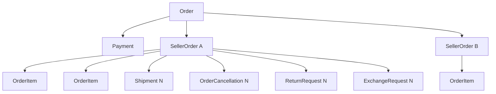
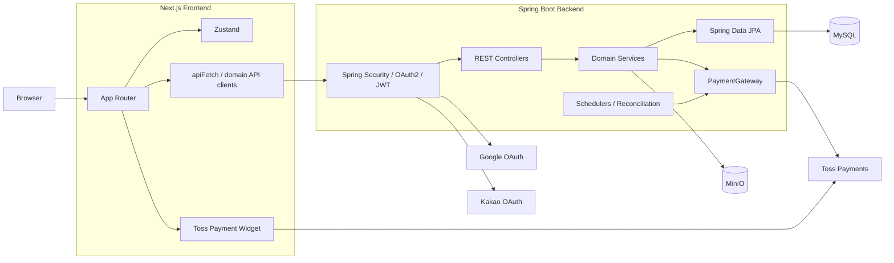

# Gift Market

> Spring Boot + Next.js로 구현한 **실제 운영 지향 오픈마켓 쇼핑몰**입니다.  
> 단순 상품 CRUD 데모가 아니라 주문·재고·결제·부분취소·반품·교환·배송·판매자 운영까지 하나의 commerce workflow로 연결하는 것을 목표로 합니다.


---

## 목차

- [프로젝트 개요](#프로젝트-개요)
- [현재 구현 상태](#현재-구현-상태)
- [핵심 특징](#핵심-특징)
- [아키텍처](#아키텍처)
- [주요 도메인 설계](#주요-도메인-설계)
- [기술 스택](#기술-스택)
- [저장소 구조](#저장소-구조)
- [주요 화면 및 Route](#주요-화면-및-route)
- [API 개요](#api-개요)
- [로컬 실행](#로컬-실행)
- [환경변수](#환경변수)
- [DB / Migration](#db--migration)
- [테스트 및 검증](#테스트-및-검증)
- [보안 원칙](#보안-원칙)
- [운영 배포 전 남은 작업](#운영-배포-전-남은-작업)
- [문서](#문서)
- [개발 원칙](#개발-원칙)

---

## 프로젝트 개요

Gift Market은 구매자와 판매자가 함께 사용하는 오픈마켓형 쇼핑몰입니다.

카카오톡 선물하기 및 국내 주요 커머스에서 익숙한 사용자 흐름을 참고하되, 특정 서비스의 UI·브랜드·자산을 복제하지 않고 독립적인 서비스 구조로 구현합니다.

현재 프로젝트는 다음을 중요하게 다룹니다.

- **Backend를 금액·재고·상태의 최종 권위로 사용**
- 단순 주문 성공뿐 아니라 **실패·중복 요청·timeout·재시도**까지 고려
- 멀티셀러 주문에서 `Order`와 `SellerOrder` 역할 분리
- 전체취소와 **상품/수량 단위 부분취소·부분환불**
- 배송 완료 후 **Return / Exchange 별도 workflow**
- 교환 target 재고 reservation / release / consume
- Toss Payments 결과 불명 상태 reconciliation
- 최초배송·반품회수·교환회수·교환재배송을 보존하는 `Shipment 1:N`
- 과거 주문 이력을 깨뜨리지 않는 ProductVariant soft deactivation
- 실제 사용자별 Wishlist / Cart / Profile / Address 데이터 분리
- Seller Center와 관리자 승인 흐름
- 운영환경 Secret과 배포환경 설정 분리

---

## 현재 구현 상태

### Buyer

- Google / Kakao OAuth 로그인
- JWT Access Token + Refresh Token Cookie
- 회원정보 / 프로필 이미지
- 배송지 CRUD
- 회원별 Wishlist
- 상품 목록 / 검색 / 카테고리 / 품절 제외 / pagination
- 상품 상세 / 옵션 Variant / 재고
- 장바구니
- 주문서
- Toss Payments 결제
- 주문 목록 / 주문 상세
- 전체취소
- 상품·수량 단위 부분취소
- 반품 신청 / 진행 조회
- 교환 신청 / target Variant 선택
- 구매자 귀책 교환배송비 추가결제
- 구매확정
- 상품문의
- 구매확정 기반 리뷰 및 이미지 업로드

### Seller

- 판매자 신청
- 상품 CRUD
- 상품 이미지
- 옵션 그룹 / 옵션 값 / Variant / 재고 관리
- 주문 관리
- 출고 / 배송완료
- 취소 승인 / 거절
- 반품 승인 / 거절 / 회수 / 입고 / 검수
- 교환 승인 / 거절 / 회수 / 입고 / 검수 / 재배송 / 완료
- 상품문의 답변
- Dashboard Action Center
- 처리 필요 주문·취소·반품·교환 집계
- 최근 주문 / 상품 요약

### Admin

- 판매자 신청 목록
- 판매자 승인
- ADMIN 자신의 Seller 등록 지원
  - 일반 Seller 등록 폼 사용
  - 신청 이력 생성
  - 같은 transaction에서 자동 승인
  - `ACTIVE Seller` 생성
  - ADMIN role 유지

> Seller Center 접근의 최종 기준은 단순 role이 아니라 **현재 사용자에게 속한 ACTIVE Seller 존재 여부**입니다.

### Payment / Claim

- 주문 결제 READY → CONFIRMING → PAID
- READY 자동 만료 및 예약 재고 복원
- CONFIRMING 결과 불명 reconciliation
- Toss webhook 중복 처리
- FULL 전체취소
- FULL CANCELING reconciliation
- PARTIAL 부분취소 / 부분환불
- Payment 환불 잔액 검증
- 부분 재고 복원
- Return PARTIAL 환불
- Return refund reconciliation / completion recovery
- ExchangeShippingPayment
- 교환배송비 결제 재시도 / 결과 불명 reconciliation
- 교환 결제 만료와 reservation release
- 늦은 결제 성공 compensation 분리

---

## 핵심 특징

### 1. 멀티셀러 주문 구조

한 번의 결제는 하나의 `Order / Payment`로 유지하면서 판매자별 처리 단위를 `SellerOrder`로 분리합니다.



한 판매자의 주문만 취소되더라도 다른 판매자의 배송은 계속 진행할 수 있습니다.

---

### 2. 전체취소와 부분취소 분리

업무 요청과 PG 환불 transaction을 분리합니다.

```text
OrderCancellation
= 어떤 SellerOrder / OrderItem / 수량을 취소하는지

PaymentCancellation
= 실제 PG에서 얼마가 환불되었는지
```

`PaymentCancellationType`:

```text
FULL
PARTIAL
```

부분취소 성공 후 결제 잔액이 남으면:

```text
Payment = PARTIALLY_CANCELED
Order   = PAID
```

잔액이 0이면:

```text
Payment = CANCELED
```

---

### 3. PG timeout을 곧바로 실패로 처리하지 않음

결제/취소 HTTP timeout, connection reset, 5xx, 응답 유실은 실제 PG 성공 여부를 알 수 없는 상태일 수 있습니다.

따라서 Gift Market은 결과 불명 상태에서 임의 재실행하지 않고 provider transaction을 다시 조회합니다.

```text
DB transaction
→ 외부 PG 호출
→ 결과 확정 transaction

결과 불명
→ 상태 유지
→ scheduler / webhook / polling
→ Toss 단건 조회
→ 기존 completion transaction 재사용
```

이 구조로 중복 승인·중복 환불·중복 재고복원을 방지합니다.

---

### 4. Shipment 1:N

`SellerOrder` 한 행에 송장번호 하나만 저장하면 교환 시 최초 송장 이력이 사라집니다.

현재는 다음 배송을 각각 보존합니다.

```text
ORIGINAL_OUTBOUND    판매자 → 구매자
RETURN_COLLECTION    구매자 → 판매자
EXCHANGE_COLLECTION  구매자 → 판매자
EXCHANGE_OUTBOUND    판매자 → 구매자
```

`SellerOrder`는 주문 처리 lifecycle을, `Shipment`는 실제 물류 이동과 송장 이력을 담당합니다.

---

### 5. Return과 Exchange를 Cancellation과 분리

배송 전:

```text
PAID / PREPARING
→ OrderCancellation
```

배송 완료 후:

```text
DELIVERED
→ ReturnRequest / ExchangeRequest
```

반품·교환은 회수와 검수가 필요하므로 배송 전 취소와 같은 aggregate로 처리하지 않습니다.

---

### 6. 교환 target 재고 reservation

교환 신청 시 현재 재고는 UX 사전검사만 수행합니다.

실제 재고 확보는 판매자 승인 transaction에서 Product/Variant를 다시 잠그고 진행합니다.

```text
reservedQuantity
releasedQuantity
consumedQuantity
```

불변식:

```text
0 <= released + consumed <= reserved <= exchange quantity
```

- 승인: target 재고 예약
- 미결제 만료/취소: reservation release
- 교환품 재배송: reservation consume
- 재배송 시 stock을 다시 차감하지 않음

---

### 7. 구매확정 수량 기반 Claim / Review

`OrderItem.confirmedQuantity`를 별도 관리합니다.

구매확정된 수량은 이후 취소·반품·교환 가능 수량에서 제외됩니다.

완료된 교환 상품은 구매가 사라진 것이 아니므로 최종 보유 수량으로 다시 구매확정할 수 있습니다.

리뷰는 구매확정된 `OrderItem`을 기준으로 작성하며 완료 교환이 존재하면 최신 완료 target 상품/Variant snapshot을 사용합니다.

---

### 8. ProductVariant 이력 보존

옵션 수정으로 더 이상 사용하지 않는 Variant를 물리 삭제하지 않습니다.

```text
active = false
```

과거 `OrderItem.variant` 참조를 유지하고, 동일 `combinationKey`가 다시 생성되면 기존 inactive Variant를 재활성화합니다.

---

### 9. 서버 기반 Wishlist

Wishlist는 localStorage가 아니라 사용자별 Backend 데이터가 source of truth입니다.

이로써 같은 브라우저에서 계정을 변경해도 다른 사용자의 Wishlist가 섞이지 않고 상품의 현재 판매상태도 최신 DB 기준으로 반영할 수 있습니다.

---

### 10. 공통 Pagination / 조회 상태

Frontend 공통 Pagination 정책:

```text
<<  <  3  4  [5]  6  7  >  >>
```

- 내부 page는 0-based
- 숫자 최대 5개
- first / previous / next / last
- 경계 disabled
- URL Link / local state 지원
- `scroll` / `summary` mode 호환

또한 loading/API error를 실제 `0건`, `0.0점`으로 표시하지 않아 정상 빈 상태와 조회 실패를 구분합니다.

---

## 아키텍처



### Backend 원칙

```text
Controller
→ DTO
→ Service transaction
→ Repository / Entity
```

- Entity 직접 response 노출 금지
- 생성자 주입
- Bean Validation
- Global Exception Handler
- 공통 `ApiResponse`
- ownership 검증은 Service
- 돈/재고/Claim 상태는 Backend 최종 검증
- 외부 PG HTTP를 긴 DB transaction 안에서 호출하지 않음
- pessimistic lock + terminal state 재검증
- idempotency key 및 reconciliation

### Frontend 원칙

```text
Page / Component
→ lib/*-api.ts
→ apiFetch
→ Backend
```

- Next.js App Router
- TypeScript
- Zustand
- 일반 CSS
- Tailwind dependency는 존재하지만 신규 UI에서 utility class 사용 안 함
- loading / error / double-submit 고려
- URL 기반 검색·필터·pagination 상태 유지
- 서버 응답을 최종 데이터로 사용

---

## 주요 도메인 설계

### 주문

```text
Order
├─ Payment
│  └─ PaymentCancellation N
│
└─ SellerOrder N
   ├─ OrderItem N
   ├─ Shipment N
   ├─ OrderCancellation N
   ├─ ReturnRequest N
   └─ ExchangeRequest N
```

### 배송

```text
SellerOrder 1 : N Shipment
```

### 반품

```text
REQUESTED
→ APPROVED
→ COLLECTING
→ RECEIVED
→ INSPECTED
→ REFUNDING
→ COMPLETED
```

검수 결과:

```text
RESTOCKABLE
NON_RESTOCKABLE
```

`RESTOCKABLE`만 판매 가능 재고로 복원합니다.

### 교환

```text
REQUESTED
→ 판매자 승인 + target reservation

BUYER 귀책
→ PAYMENT_PENDING
→ 교환배송비 결제
→ COLLECTING

SELLER 귀책
→ COLLECTING

COLLECTING
→ RECEIVED
→ INSPECTED
→ RESHIPPING
→ COMPLETED
```

현재 자동 교환 정책:

- 동일 Product
- 동일 Variant 또는 다른 Variant
- target 현재 판매단가가 원 `OrderItem.unitPrice`와 동일
- 가격 차이 교환 미지원
- 가격 차이가 있으면 반품 후 재주문
- BUYER 귀책 배송비는 별도 `ExchangeShippingPayment`
- SELLER 귀책은 추가결제 없음

---

## 기술 스택

### Backend

| 영역 | 기술 |
|---|---|
| Language | Java 21 |
| Framework | Spring Boot 4.1.0 |
| Web | Spring Web MVC |
| Security | Spring Security |
| OAuth | Google OAuth/OIDC, Kakao OAuth |
| Authentication | JWT Access Token + Refresh Token Cookie |
| ORM | Spring Data JPA / Hibernate |
| Database | MySQL |
| Object Storage | MinIO |
| Payment | Toss Payments |
| HTML Sanitizing | jsoup |
| Build | Gradle |
| Monitoring foundation | Spring Boot Actuator |

### Frontend

| 영역 | 기술 |
|---|---|
| Framework | Next.js 16.2.11 App Router |
| UI | React 19.2.4 |
| Language | TypeScript 5 |
| Client State | Zustand |
| Query dependency | TanStack Query |
| Rich Text | Tiptap |
| Payment | Toss Payments SDK |
| Styling | Plain CSS |
| Lint | ESLint |

---

## 저장소 구조

```text
gift-market/
├─ AGENTS.md
├─ README.md
├─ DOCS_UPDATE_NOTES.md
│
├─ giftmarket-api/
│  ├─ build.gradle
│  └─ src/
│     ├─ main/
│     │  ├─ java/com/giftmarket/
│     │  │  ├─ address/
│     │  │  ├─ admin/
│     │  │  ├─ auth/
│     │  │  ├─ cart/
│     │  │  ├─ global/
│     │  │  ├─ inquiry/
│     │  │  ├─ order/
│     │  │  ├─ payment/
│     │  │  ├─ product/
│     │  │  ├─ review/
│     │  │  ├─ seller/
│     │  │  ├─ user/
│     │  │  └─ wishlist/
│     │  └─ resources/
│     │     └─ application-example.yaml
│     └─ test/
│
├─ giftmarket-web/
│  ├─ app/
│  ├─ components/
│  ├─ lib/
│  ├─ stores/
│  ├─ styles/
│  ├─ types/
│  └─ .env.sample
│
└─ docs/
   ├─ DEVELOPMENT_STATUS.md
   ├─ PAYMENT_ARCHITECTURE_DESIGN.md
   ├─ ORDER_CANCELLATION_REFUND_DESIGN.md
   ├─ ORDER_RETURN_EXCHANGE_DESIGN.md
   ├─ TROUBLESHOOTING.md
   └─ sql/
```

---

## 주요 화면 및 Route

### Buyer

```text
/
├─ /products
├─ /products/[productId]
├─ /cart
├─ /order
├─ /payment/success
├─ /payment/fail
├─ /my
├─ /my/profile
├─ /my/addresses
├─ /my/wishlist
├─ /my/orders
├─ /my/orders/[orderId]
├─ /my/exchanges/payment/success
├─ /my/exchanges/payment/fail
├─ /terms
├─ /privacy
├─ /policy/returns
└─ /support
```

### Seller

```text
/seller
├─ /seller/apply
├─ /seller/application
├─ /seller/dashboard
├─ /seller/products
├─ /seller/products/new
├─ /seller/products/[productId]
├─ /seller/products/[productId]/edit
├─ /seller/orders
├─ /seller/orders/[sellerOrderId]
├─ /seller/orders/cancellations
├─ /seller/orders/returns
├─ /seller/orders/exchanges
└─ /seller/inquiries
```

### Admin

```text
/admin/seller-applications
```

정산·스토어 설정·전체 Admin Backoffice 등은 향후 기능 범위이며, 현재 core Buyer/Seller E2E 완료 범위와 구분합니다.

---

## API 개요

아래는 대표 API이며 전체 contract는 Controller 및 DTO를 기준으로 합니다.

### Auth / User

```text
POST /api/auth/token
GET  /api/auth/me
GET  /api/users/me
```

### Product

```text
GET  /api/products
GET  /api/products/{productId}

POST /api/seller/products
...
```

### Wishlist / Cart

```text
GET    /api/wishlist
POST   /api/wishlist/{productId}
DELETE /api/wishlist/{productId}
GET    /api/wishlist/count

GET /api/cart
...
```

### Order / Payment

```text
POST  /api/orders/prepare
GET   /api/orders
GET   /api/orders/{orderId}
PATCH /api/orders/{orderId}/cancel

POST /api/payments/confirm
POST /api/payments/webhooks/toss
```

### Cancellation

```text
POST /api/orders/{orderId}/cancellations
GET  /api/orders/{orderId}/cancellations

GET   /api/seller/orders/cancellations
PATCH /api/seller/orders/cancellations/{cancellationId}/approve
PATCH /api/seller/orders/cancellations/{cancellationId}/reject
```

### Return

```text
POST /api/orders/{orderId}/seller-orders/{sellerOrderId}/returns
GET  /api/orders/{orderId}/returns
GET  /api/returns/{returnRequestId}

GET   /api/seller/orders/returns
PATCH /api/seller/orders/returns/{returnRequestId}/approve
PATCH /api/seller/orders/returns/{returnRequestId}/reject
PATCH /api/seller/orders/returns/{returnRequestId}/collect
PATCH /api/seller/orders/returns/{returnRequestId}/receive
PATCH /api/seller/orders/returns/{returnRequestId}/inspect
```

### Exchange

```text
POST /api/orders/{orderId}/seller-orders/{sellerOrderId}/exchanges
GET  /api/orders/{orderId}/exchanges
GET  /api/exchanges/{exchangeRequestId}

GET   /api/seller/orders/exchanges
PATCH /api/seller/orders/exchanges/{exchangeRequestId}/approve
PATCH /api/seller/orders/exchanges/{exchangeRequestId}/reject
PATCH /api/seller/orders/exchanges/{exchangeRequestId}/collect
PATCH /api/seller/orders/exchanges/{exchangeRequestId}/receive
PATCH /api/seller/orders/exchanges/{exchangeRequestId}/inspect
PATCH /api/seller/orders/exchanges/{exchangeRequestId}/reship
PATCH /api/seller/orders/exchanges/{exchangeRequestId}/deliver
```

### Inquiry / Review

```text
GET/POST/PATCH/DELETE Product Inquiry API
Seller Inquiry Answer API

Product Review 조회
Buyer Review 작성/수정/삭제
```

---

## 로컬 실행

### 1. 사전 요구사항

- Java 21
- Node.js / npm
- MySQL
- MinIO
- Google OAuth Client
- Kakao OAuth Client
- Toss Payments test key

> 실제 Secret은 저장소에 커밋하지 않습니다.

### 2. Backend 설정

샘플:

```text
giftmarket-api/src/main/resources/application-example.yaml
```

로컬 실행 환경에 필요한 값을 환경변수로 제공합니다.

Backend 실행:

```bash
cd giftmarket-api
./gradlew bootRun
```

기본 주소:

```text
http://localhost:8080
```

### 3. Frontend 설정

샘플:

```text
giftmarket-web/.env.sample
```

예:

```dotenv
NEXT_PUBLIC_API_BASE_URL=http://localhost:8080
NEXT_PUBLIC_STORAGE_BASE_URL=http://localhost:9000/gift-market
NEXT_PUBLIC_TOSS_CLIENT_KEY=your-toss-client-key
```

Frontend 실행:

```bash
cd giftmarket-web
npm install
npm run dev
```

기본 주소:

```text
http://localhost:3000
```

### 4. MinIO

기본 bucket 예시:

```text
gift-market
```

프로젝트는 상품·프로필·Return/Exchange 증빙·Review 이미지 등에 MinIO presigned URL 방식을 사용합니다.

DB에는 가능한 한 object URL 전체가 아니라 object key를 저장합니다.

### 5. 카테고리 Seed

신규 DB에서 상품 등록에 사용할 최소 활성 카테고리가 없다면 다음 수동 seed를 확인합니다.

```text
docs/sql/category-seed.sql
```

`docs/sql` 파일은 자동 migration 파일이 아닙니다.

---

## 환경변수

### Backend

`application-example.yaml` 기준 주요 값:

```text
DB_URL
DB_USERNAME
DB_PASSWORD

GOOGLE_CLIENT_ID
GOOGLE_CLIENT_SECRET

KAKAO_CLIENT_ID
KAKAO_CLIENT_SECRET

JWT_SECRET
FRONTEND_URL
REFRESH_COOKIE_SECURE

MINIO_ENDPOINT
MINIO_ACCESS_KEY
MINIO_SECRET_KEY
MINIO_BUCKET

TOSS_SECRET_KEY

JPA_DDL_AUTO
SERVER_PORT
```

### Frontend

```text
NEXT_PUBLIC_API_BASE_URL
NEXT_PUBLIC_STORAGE_BASE_URL
NEXT_PUBLIC_TOSS_CLIENT_KEY
```

### Secret 주의

다음 값은 README, 코드, 테스트, 로그, Issue에 실제 값을 남기지 않습니다.

```text
JWT_SECRET
GOOGLE_CLIENT_SECRET
KAKAO_CLIENT_SECRET
TOSS_SECRET_KEY
MINIO_SECRET_KEY
DB password
Access Token
Refresh Token
```

---

## DB / Migration

현재 로컬 개발환경은 Hibernate:

```text
ddl-auto:update
```

를 사용합니다.

다만:

```text
docs/sql/*.sql
```

은 자동 실행되는 Flyway migration이 아니라 개발 DB 확인·backfill·수동 DDL 참고본입니다.

따라서 Hibernate가 이미 반영한 컬럼/제약을 SQL로 중복 실행하지 않아야 합니다.

운영환경에서는:

```text
ddl-auto=validate
+ Flyway 또는 Liquibase 같은 versioned migration
```

구조로 전환하는 것이 배포 전 남은 작업입니다.

---

## 테스트 및 검증

### Backend

```bash
cd giftmarket-api
./gradlew test
```

2026-08-28 최신 작업 보고 기준:

```text
511 tests
511 success
0 failure
0 error
```

### Frontend

```bash
cd giftmarket-web
npm run lint
npx tsc --noEmit
npm run build
```

2026-08-28 최신 작업 보고 기준:

```text
lint      success
tsc       success
build     success
static pages 34
```

> 위 숫자는 특정 커밋에 영구 고정된 계약값이 아닙니다. 이후 코드가 변경되면 실제 최신 테스트 결과를 기준으로 판단합니다.

### 실제 E2E에서 확인한 범위

- Return 요청 → 승인 → 회수 → 입고 → 검수 → 환불 → 완료
- BUYER 귀책 Exchange
- 동일가격 다른 Variant 교환
- target reservation
- Toss 교환배송비 6,000원 결제
- 회수 Shipment
- RESTOCKABLE 원 재고 복원
- 교환 재배송 Shipment
- reservation consume
- `exchangedQuantity`
- Exchange COMPLETED

아직 최종 완료로 기록하지 않는 외부환경 검증:

- SELLER 귀책 Exchange 실제 E2E
- 실제 timeout/5xx를 유발한 PG 장애 E2E
- 공개 HTTPS staging 전체 회귀

---

## 보안 원칙

### 인증 / 권한

- JWT Access Token
- Refresh Token HttpOnly Cookie
- Google/Kakao OAuth
- `/api/admin/**`는 ADMIN
- Seller API는 인증 후 **ACTIVE Seller + ownership**을 Service에서 최종 검증
- Frontend role guard를 보안수단으로 신뢰하지 않음

### Object Storage

신규 프로필 object key:

```text
profiles/{userId}/{uuid}.{ext}
```

사용자 prefix ownership을 검증합니다.

legacy:

```text
profile/{uuid}
```

는 읽기 호환만 유지합니다.

Review / Return / Exchange 이미지도 user-scoped prefix와 presigned URL을 사용합니다.

### Payment

- Toss Secret Key는 Backend에서만 사용
- Frontend는 공개 Client Key만 사용
- PG raw sensitive payload를 DB에 저장하지 않음
- webhook payload만 보고 최종 상태를 확정하지 않음
- idempotency key 고정
- 결과 불명은 reconciliation

---

## 운영 배포 전 남은 작업

핵심 Buyer/Seller commerce workflow는 대부분 구현되어 있습니다.

현재 큰 남은 범위는 **새 기능 추가보다 운영환경 준비와 외부 E2E 검증**입니다.

1. development / staging / production profile 분리
2. HTTPS
3. Refresh cookie `Secure` / `SameSite`
4. production CORS
5. Google/Kakao OAuth redirect URI
6. Frontend API / Storage URL 외부환경 설정
7. MinIO external endpoint / bucket / CORS / 영속 스토리지
8. Toss 상점용 test key + 공개 webhook 검증
9. versioned DB migration
10. backup / rollback
11. 운영 log / metric / alert
12. 실패 결제·환불·보상 runbook
13. SELLER 귀책 Exchange 실제 E2E
14. timeout / 5xx 실제 장애 E2E
15. Storage base URL 설정 오류 관측성
16. Modal keyboard accessibility 최종 점검
17. Seller Center 모바일 sidebar 최종 점검
18. `/support`, `/terms`, `/privacy` 실제 운영 정보 확정

향후 선택 기능:

- Seller 리뷰 관리 / 답글
- 알림
- 쿠폰 / 포인트
- 랭킹 / 추천
- 정산 관리
- 스토어 설정
- 회원 탈퇴
- 전체 Admin 운영 Backoffice

---

## 문서

프로젝트의 상세 설계와 현재 상태는 `docs/`에 유지합니다.

| 문서 | 설명 |
|---|---|
| [`AGENTS.md`](./AGENTS.md) | 프로젝트 개발 규칙, 현재 구조, Codex/AI 작업 기준 |
| [`DOCS_UPDATE_NOTES.md`](./DOCS_UPDATE_NOTES.md) | 최신 문서 동기화 변경 요약 |
| [`docs/DEVELOPMENT_STATUS.md`](./docs/DEVELOPMENT_STATUS.md) | 현재 구현/검증/배포 준비 상태 |
| [`docs/PAYMENT_ARCHITECTURE_DESIGN.md`](./docs/PAYMENT_ARCHITECTURE_DESIGN.md) | 결제, 전체취소, 부분환불, reconciliation |
| [`docs/ORDER_CANCELLATION_REFUND_DESIGN.md`](./docs/ORDER_CANCELLATION_REFUND_DESIGN.md) | 주문 부분취소/부분환불 |
| [`docs/ORDER_RETURN_EXCHANGE_DESIGN.md`](./docs/ORDER_RETURN_EXCHANGE_DESIGN.md) | Shipment, Return, Exchange 전체 설계 |
| [`docs/TROUBLESHOOTING.md`](./docs/TROUBLESHOOTING.md) | 실제 개발 중 발생한 문제와 해결 구조 |
| [`docs/sql/`](./docs/sql/) | 개발 DB 수동 검증/backfill/DDL 참고본 |

문서와 코드가 충돌하면 **현재 실제 코드가 우선**합니다.

---

## 개발 원칙

이 프로젝트는 다음 우선순위로 개발합니다.

```text
1. 구현
2. 기능 완성
3. 코드 품질
4. 리팩토링
```

그리고 다음을 지킵니다.

- 기존 정상 기능을 불필요하게 다시 작성하지 않음
- 기존 package / naming / CSS convention 유지
- DTO 사용
- 생성자 주입
- Validation
- Global Exception Handler
- RESTful API
- 공통 응답 형식
- ownership Backend 검증
- 관련 없는 대규모 리팩토링 금지
- 실제 Secret 저장소 커밋 금지
- 주문/재고/결제/Claim 정합성을 UI 편의보다 우선
- 운영 가능한 구조를 목표로 하되 불필요한 과설계는 피함

---

## 현재 한 줄 요약

> **상품 등록부터 결제, 멀티셀러 주문, 부분취소·부분환불, 배송, 반품, 교환, 구매확정, 리뷰, Seller 운영까지 연결된 오픈마켓 commerce core를 구현했고, 현재는 production/staging 운영 준비와 외부환경 회귀 검증 단계에 있습니다.**
